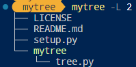
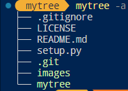
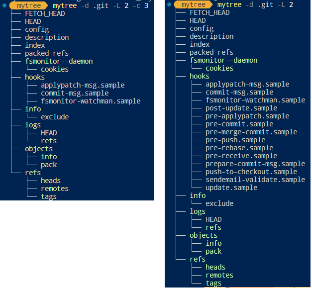

- [1. Install](#1-install)
  - [1.1. Git](#11-git)
  - [1.2. Manual](#12-manual)
- [2. Usage](#2-usage)


---
## 1. Install

### 1.1. Git

```bash
pip install . git+https://github.com/sword4869/mytree.git
```

### 1.2. Manual

```bash
cd mytree
pip install -e .
```


## 2. Usage

```python
python -m mytree -h
usage: mytree.py [-h] [-L MAX_LAYER] [-a] [-c COMPACT_FILES] [-d DIRECTORY]

options:
  -h, --help            show this help message and exit
  -L MAX_LAYER, --max_layer MAX_LAYER
                        the number of limited layers
  -a, --is_show_hidden  dont show hidden files or directories
  -c COMPACT_FILES, --compact_files COMPACT_FILES
                        maximum number of showed files under the same directory, default is infinity
  -d DIRECTORY, --directory DIRECTORY
                        working directory
```

  

  

  
